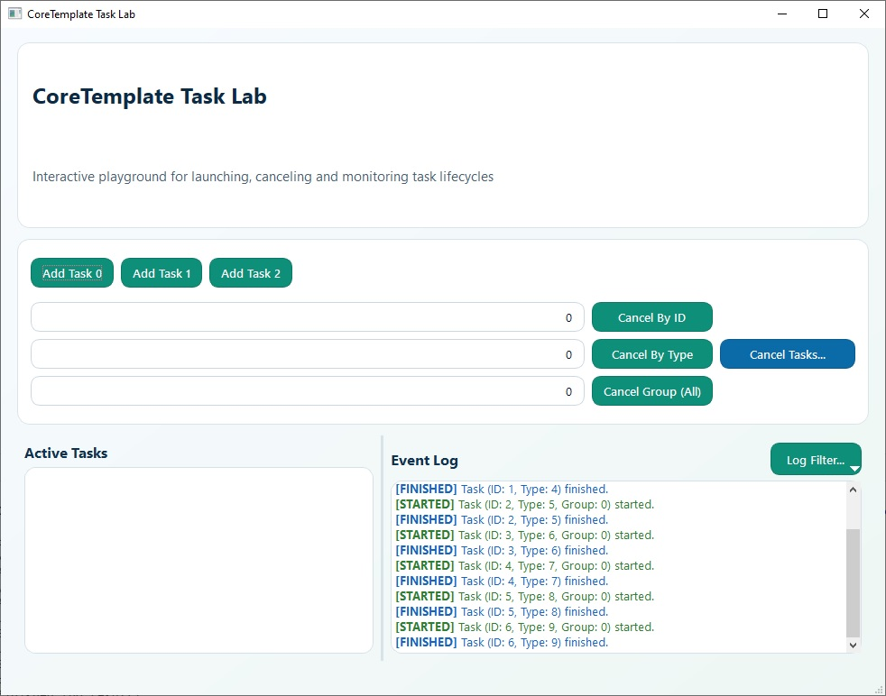

# 🧵 CoreTemplate

A modern, header-only C++/Qt library for **safe and efficient task execution in separate threads**, with built-in support for grouping, cooperative stopping, and type-safe registration.

[](https://github.com/valeksan/CoreTemplate/actions)
[](LICENSE)
[](https://en.cppreference.com/w/cpp/20)
[](https://www.qt.io/)

## ✨ Why CoreTaskManager?

- ✅ **Zero overhead**: Header-only, no extra dependencies.
- ✅ **Type-safe**: Compile-time checks for function signatures (thanks to `std::function`, `if constexpr`, `std::any`).
- ✅ **Grouping**: Run only one task per group (e.g., "network", "file I/O").
- ✅ **Cooperative cancellation**: Tasks can check `stopTaskFlag()` and exit gracefully.
- ✅ **Modern C++**: Uses `std::atomic`, `std::bind`, `enum class`, `QMetaType`, `QSharedPointer`.

## 🚀 Quick Start

```cpp
// 1. Init task manager
auto m_pCore = new Core();

// 2. Register a task
m_pCore->registerTask(TASK_CALCULATE, [](int a, int b) -> int {
    QThread::msleep(100); // Simulate work
    return a + b;
});

// 3. Add it to the queue
m_pCore->addTask(TASK_CALCULATE, 10, 20);

// 4. Handle result
connect(m_pCore, &Core::finishedTask, this, [](TaskId id, TaskType type, const QVariant& result) {
    qDebug() << "Result:" << result.toInt();
});
```

## 📦 Installation

Just copy core.h into your project. It's header-only!

## 🧪 Example

See **example/** directory for a full Qt Widgets app demonstrating all features.

*For Qt6, it is preferable to use **CMakeLists.txt** when opening a project, and if Qt5 then **example_app.pro**.*



## 🧩 Features

- Executes registered functions/lambdas/functors in dedicated threads.
- Supports task grouping (only one task per group runs at a time).
- Provides mechanisms for stopping and terminating tasks.
- Allows querying task status (registered, idle, added by type/group).

## 🏛️ Architecture and Usage Rules

**IMPORTANT:** The `Core` class is **not thread-safe** for its public interface methods. To ensure stability:

- **All calls to public methods** (e.g., `registerTask`, `addTask`, `stopTaskById`, `terminateTaskById`, `isTask...`, etc.) **must originate from the same thread** where the `Core` object lives. Typically, this is the **main GUI thread**.
- Functions registered via `registerTask` are executed in their own dedicated threads managed by the library.
- Code running inside a registered task function **should avoid calling public `Core` methods directly**, as this can lead to race conditions and undefined behavior. If a task needs to interact with the `Core`, it should use `QMetaObject::invokeMethod` to send a message to the main thread, which then performs the action safely.

## 🧾 Core Interface

- `registerTask`: Registers a function/lambda/functor for later execution by type.
- `addTask`: Adds a registered task to the execution queue.
- `unregisterTask`: Removes a task type from registration.
- `stopTaskById`, `stopTaskByType`, `stopTaskByGroup`, `stopTasks`: Request graceful stop of tasks.
- `terminateTaskById`: Forcefully terminates a task by ID.
- `isTaskRegistered`, `isIdle`, `isTaskAddedByType`, `isTaskAddedByGroup`: Query task status.
- `groupByTask`: Get the group associated with a task type.
- `stopTaskFlag`: Get a flag for the current thread to allow cooperative stopping within a task function.

## 🧵 Threading Model

1. Main Thread: Hosts the `Core` object. All public API calls should come from here.
2. Task Threads: Created internally by the library for each task execution. Registered functions run here.
3. Communication: Interaction between Task Threads and Main Thread happens via Qt's signal/slot mechanism (e.g., `TaskHelper::finished`) or `QTimer` events scheduled on the main thread (e.g., in `stopTask`).

## 🛡️ Safety Considerations

- Adhering to the single-threaded access rule for the public Core Interface is crucial.
- Be cautious with `QTimer::singleShot` and `connect` callbacks if they access shared data outside of `Core`'s internal structures, especially if those accesses are not synchronized or atomic.
- The `Core` class uses Qt types (`QList`, `QHash`, `QSharedPointer`) which manage their own lifetimes. However, the concurrent access to these types from different threads is avoided by the usage rules.

## ⚙️ How It Works

1. An instance of the `Core` class is created.
2. Callables are registered with `Core::registerTask(...)`, assigning them a unique `taskType` integer and optional group and timeout settings.
3. Tasks are queued for execution using `Core::addTask(taskType, ...args)`.
4. The `Core` manages a queue and ensures only one task per group runs at a time.
5. When a slot opens up (either due to a previous task finishing or because the task belongs to a different group), the `Core` starts the next eligible task in its own thread using `CreateThread` (Windows) or `pthread_create` (Unix-like systems).
6. The task's associated function executes within the new thread.
7. While executing, a task can check a shared stop flag retrieved via `Core::stopTaskFlag()` to perform graceful shutdowns.
8. Upon completion (normal, stopped, or terminated), the task emits a signal (`finishedTask`, `terminatedTask`) back to the main thread where the `Core` lives.
9. The `Core` updates its internal lists of active and queued tasks and proceeds to start the next queued task if applicable.

## 📌 Important Notes

- **Platform Specifics:** The library uses `CreateThread`/`TerminateThread` on Windows and `pthread_create`/`pthread_cancel` on Unix-like systems for low-level thread management.
- **Thread Safety:** The `Core` object itself is designed to be used from the main thread (or a single managing thread). Its methods for adding/stopping tasks are called from the main thread, and its signals are emitted from the main thread context. Access to the internal stop flag (`Core::stopTaskFlag()`) is intended for use *within* the executing task's thread.
- **Header-Only:** The library is implemented entirely within `core.h` as an inline/header-only library.
- **Requirements:** Requires Qt 6.x (specifically tested against 6.10.2) and C++17 support.

## 📦 Prerequisites

- Qt6.x (Tested on version 6.10.2 on Windows 10, but it should theoretically work on Qt5)
- C++20 compatible compiler

## ✏️ Basic Example

```cpp
#include "core.h"
#include <QApplication>
#include <QDebug>

int main(int argc, char *argv[])
{
    QApplication app(argc, argv);

    Core core;

    // Define a simple task
    auto simpleTask = [](int x) -> int {
        qDebug() << "Running simple task with arg:" << x;
        return x * 2;
    };

    // Register the task with type ID 1
    core.registerTask(1, simpleTask);

    // Connect to the finished signal to handle results
    QObject::connect(&core, &Core::finishedTask, [](long id, int type, const QVariantList &args, const QVariant &result) {
        qDebug() << "Task finished:" << id << "Type:" << type << "Args:" << args << "Result:" << result;
    });

    // Add the task for execution with argument 21
    core.addTask(1, 21);

    // Your application event loop would normally run here.
    // For this example, we'll just wait a bit to see the task complete.
    QTimer timer;
    timer.setSingleShot(true);
    timer.start(2000); // Wait 2 seconds
    QObject::connect(&timer, &QTimer::timeout, &app, &QApplication::quit);

    return app.exec();
}
```

## ✏️ Grouping Example

```cpp
#include "core.h"
#include <QApplication>
#include <QDebug>
#include <QThread>
#include <QTimer>

int main(int argc, char *argv[])
{
    QApplication app(argc, argv);

    Core core;

    // Define tasks for Group 1 (Resource A)
    auto taskForResourceA1 = [](int id) -> int {
        qDebug() << "Group 1 Task" << id << "- Starting on thread:" << QThread::currentThread();
        QThread::msleep(2000); // Simulate work taking 2 seconds
        qDebug() << "Group 1 Task" << id << "- Finished";
        return id * 10;
    };

    auto taskForResourceA2 = [](int id) -> int {
        qDebug() << "Group 1 Task" << id << "- Starting on thread:" << QThread::currentThread();
        QThread::msleep(1000); // Simulate work taking 1 second
        qDebug() << "Group 1 Task" << id << "- Finished";
        return id * 20;
    };

    // Define a task for Group 2 (Resource B) - Can run concurrently with Group 1
    auto taskForResourceB = [](int id) -> int {
        qDebug() << "Group 2 Task" << id << "- Starting on thread:" << QThread::currentThread();
        QThread::msleep(1500); // Simulate work taking 1.5 seconds
        qDebug() << "Group 2 Task" << id << "- Finished";
        return id * 30;
    };

    // Register tasks. Group 1 tasks will be serialized.
    core.registerTask(1, taskForResourceA1, 1); // Task type 1, Group 1
    core.registerTask(2, taskForResourceA2, 1); // Task type 2, Group 1
    core.registerTask(3, taskForResourceB, 2);  // Task type 3, Group 2

    QObject::connect(&core, &Core::finishedTask, [](long id, int type, const QVariantList &args, const QVariant &result) {
        qDebug() << "Task completed - ID:" << id << "Type:" << type << "Group:" << args.first().toInt() << "Result:" << result;
    });

    // Add tasks
    qDebug() << "Adding Group 1 Task 1 (ID: 10)";
    core.addTask(1, 10); // Will start immediately

    qDebug() << "Adding Group 1 Task 2 (ID: 20) - Should wait for Task 1";
    core.addTask(2, 20); // Will wait in queue behind Task 1

    qDebug() << "Adding Group 2 Task 1 (ID: 30) - Should start immediately, parallel to Group 1 Task 1";
    core.addTask(3, 30); // Will start immediately as it's in Group 2

    // Wait longer to ensure all tasks complete
    QTimer timer;
    timer.setSingleShot(true);
    timer.start(6000); // Wait 6 seconds
    QObject::connect(&timer, &QTimer::timeout, &app, &QApplication::quit);

    return app.exec();
}
/* Expected Output (order might vary slightly due to timing):
Adding Group 1 Task 1 (ID: 10)
Adding Group 1 Task 2 (ID: 20) - Should wait for Task 1
Adding Group 2 Task 1 (ID: 30) - Should start immediately, parallel to Group 1 Task 1
Group 1 Task 10 - Starting on thread: QThread(0x...)
Group 2 Task 30 - Starting on thread: QThread(0x...) 
Group 2 Task 30 - Finished
Task completed - ID: 2 Type: 3 Group: 2 Result: 900
Group 1 Task 10 - Finished
Task completed - ID: 0 Type: 1 Group: 1 Result: 100
Group 1 Task 20 - Starting on thread: QThread(0x...) 
Group 1 Task 20 - Finished
Task completed - ID: 1 Type: 2 Group: 1 Result: 400
*/
```

## Support the Project

If you find this library helpful and wish to support its development, feel free to use the Sponsor button. Any support is voluntary and deeply appreciated, but entirely optional. The library remains free and open-source.

*P.S.
**Currently, due to regional restrictions, I don’t have access to international payment systems like Visa or PayPal.**
However, I do accept support via **cryptocurrency** (e.g., BTC). If you'd like to contribute this way, please [open an issue](https://github.com/valeksan/CoreTemplate/issues) or contact me directly — I’ll share the wallet details.
I hope to gain access to standard financial tools in the future — perhaps after relocating to a place with fewer digital barriers. Until then, crypto is my only option for receiving global support.*
