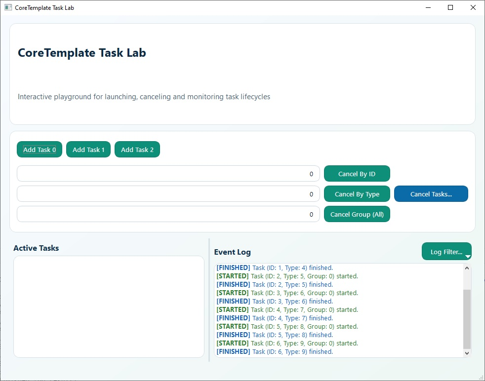

# 🧵 CoreTemplate

Современная header-only библиотека на C++/Qt для **безопасного и эффективного выполнения задач в отдельных потоках**, со встроенной поддержкой группировки, кооперативной остановки и типобезопасной регистрации.

[](https://github.com/valeksan/CoreTemplate/actions)
[](LICENSE)
[](https://en.cppreference.com/w/cpp/17)
[](https://www.qt.io/)
Этот проект распространяется под лицензией MIT — подробности см. в файле LICENSE.


*[English version](README.md)*
## Содержание

- [Возможности](#-возможности)
- [Начало работы](#-начало-работы)
- [Пример](#-пример)
- [Архитектура и правила использования](#архитектура-и-правила-использования)
- [Публичные методы](#публичные-методы)
- [Модель потоков](#модель-потоков)
- [Соображения безопасности](#соображения-безопасности)
- [Как это работает](#как-это-работает)
- [Важные замечания](#важные-замечания)
- [Предварительные условия](#предварительные-условия)
- [Базовый пример](#базовый-пример)
- [Пример группировки](#пример-группировки)
- [Поддержка проекта](#поддержка-проекта)


## ✨ Возможности

- ✅ **Header-only, нулевые накладные расходы**: Без дополнительных зависимостей, просто скопируйте `core.h` в ваш проект.
- ✅ **Типобезопасная регистрация**: Проверка сигнатур функций на этапе компиляции с использованием `std::function`, `if constexpr` и `std::any`.
- ✅ **Группировка задач**: Одновременно выполняется только одна задача в группе (например, «сеть», «файловый ввод-вывод») для сериализации доступа к общим ресурсам.
- ✅ **Кооперативная остановка**: Задачи могут проверять флаг `stopTaskFlag()` и корректно завершаться, с настраиваемыми таймаутами.
- ✅ **Современный C++17**: Использует `std::atomic`, `std::bind`, `enum class`, `QMetaType` и `QSharedPointer`.
- ✅ **Выполнение в выделенных потоках**: Каждая зарегистрированная функция выполняется в своём управляемом потоке, не блокируя главный поток.
- ✅ **Полное управление задачами**: Регистрация, удаление, добавление, остановка, принудительное завершение и запрос задач по типу, группе или ID.
- ✅ **Запрос статуса**: Проверка, зарегистрирована ли задача, простаивает, добавлена или активна.

## 🚀 Начало работы

Убедитесь, что у вас установлены **Qt 5.12 или новее** и **компилятор с поддержкой C++17** (подробности см. в разделе [Предварительные условия](#предварительные-условия)).

### Установка

Просто скопируйте файл `core.h` в ваш проект. Библиотека является header‑only!

### Быстрый старт

```cpp
// 1. Инициализация менеджера задач
auto m_pCore = new Core();

// 2. Регистрация задачи
m_pCore->registerTask(1, [](int a, int b) -> int {
    QThread::msleep(100); // Имитация работы
    return a + b;
});

// 3. Добавление задачи в очередь
m_pCore->addTask(1, 10, 20);

// 4. Обработка результата
connect(m_pCore, &Core::finishedTask, this, [](TaskId id, TaskType type, const QVariantList& argsList, const QVariant& result) {
    Q_UNUSED(id);
    Q_UNUSED(type);
    Q_UNUSED(argsList);
    qDebug() << "Result:" << result.toInt();
});
```

> **Примечание:** В примере выше используется выделение памяти в куче (`new Core()`). Вы также можете создать объект `Core` на стеке (например, `Core core;`), как показано в Базовом примере ниже.

## 🧪 Пример

См. директорию **example/** для полного Qt Widgets приложения, демонстрирующего все возможности.

*Для Qt6 предпочтительно использовать **CMakeLists.txt** при открытии проекта, а для Qt5 — **example_app.pro**.*



## Архитектура и правила использования

**ВАЖНО:** Класс `Core` **не является потокобезопасным** для своих публичных методов. Для обеспечения стабильности:

- **Все вызовы публичных методов** (например, `registerTask`, `addTask`, `cancelTaskById`, `terminateTaskById`, `isTask...` и т.д.) **должны происходить из того же потока**, в котором живёт объект `Core`. Обычно это **главный GUI‑поток**.
- Функции, зарегистрированные через `registerTask`, выполняются в собственных выделенных потоках, управляемых библиотекой.
- Код, выполняющийся внутри зарегистрированной задачи, **должен избегать прямых вызовов публичных методов `Core`**, так как это может привести к состоянию гонки и неопределённому поведению. Если задаче необходимо взаимодействовать с `Core`, следует использовать `QMetaObject::invokeMethod` для отправки сообщения в главный поток, который затем безопасно выполнит действие.

## Публичные методы

Полный список определён в заголовочном файле `core.h`. Для подробной документации обратитесь к исходному коду.

- `registerTask`: Регистрирует функцию/лямбду/функтор для последующего выполнения по типу.
- `addTask`: Добавляет зарегистрированную задачу в очередь выполнения.
- `unregisterTask`: Удаляет тип задачи из регистрации.
- `cancelTaskById`, `cancelTaskByType`, `cancelTaskByGroup`, `cancelTasks`, `cancelAllTasks`, `cancelTasksByGroup`: Запрашивают кооперативную (плавную) отмену задач.
- `stopTaskById`, `stopTaskByType`, `stopTaskByGroup`, `stopTasks`, `stopAllTasks`, `stopTasksByGroup`: Сохранены для обратной совместимости и эквивалентны `cancel...`.
- `terminateTaskById`: Более сильный путь — сначала запрашивает кооперативную остановку, затем пытается форсировать завершение при превышении timeout.
- `isTaskRegistered`, `isIdle`, `isTaskAddedByType`, `isTaskAddedByGroup`: Запрос статуса задачи.
- `groupByTask`: Получает группу, связанную с типом задачи.
- `stopTaskFlag`: Получает флаг для текущего потока, позволяющий кооперативную остановку внутри функции задачи.

## Модель потоков

1. Главный поток: содержит объект `Core`. Все вызовы публичного API должны происходить отсюда.
2. Потоки задач: создаются внутри библиотеки для каждого выполнения задачи. Зарегистрированные функции выполняются здесь.
3. Взаимодействие: обмен между потоками задач и главным потоком происходит через механизм сигналов/слотов Qt (например, `TaskHelper::finished`) или события `QTimer`, запланированные в главном потоке (например, в `stopTask`).

## Соображения безопасности

- Соблюдение правила однопоточного доступа к публичному API критически важно.
- Будьте осторожны с `QTimer::singleShot` и обратными вызовами `connect`, если они обращаются к общим данным вне внутренних структур `Core`, особенно если эти обращения не синхронизированы или не атомарны.
- Класс `Core` использует типы Qt (`QList`, `QHash`, `QSharedPointer`), которые управляют своим временем жизни. Однако параллельный доступ к этим типам из разных потоков исключён благодаря правилам использования.

## Как это работает

1. Создаётся экземпляр класса `Core`.
2. Вызываемые объекты регистрируются с помощью `Core::registerTask(...)`, им присваивается уникальный целочисленный `taskType` и, опционально, группа и таймаут остановки.
3. Задачи ставятся в очередь выполнения с помощью `Core::addTask(taskType, ...args)`.
4. `Core` управляет очередью и гарантирует, что одновременно выполняется только одна задача в группе.
5. Когда освобождается слот (либо из‑за завершения предыдущей задачи, либо потому что задача принадлежит другой группе), `Core` запускает следующую подходящую задачу в собственном потоке, используя `CreateThread` (Windows) или `pthread_create` (Unix‑подобные системы).
6. Связанная с задачей функция выполняется в новом потоке.
7. Во время выполнения задача может проверять общий флаг остановки, полученный через `Core::stopTaskFlag()`, для плавного завершения.
8. По завершении (нормальном, остановленном или принудительном) задача испускает сигнал (`finishedTask`, `terminatedTask`) обратно в главный поток, где живёт `Core`.
9. `Core` обновляет свои внутренние списки активных и ожидающих задач и приступает к запуску следующей ожидающей задачи, если это применимо.

## Важные замечания

- **Платформенные особенности:** библиотека использует `CreateThread`/`TerminateThread` на Windows и `pthread_create`/`pthread_cancel` на Unix‑подобных системах для низкоуровневого управления потоками.
- **Потокобезопасность:** сам объект `Core` предназначен для использования из главного потока (или одного управляющего потока). Его методы для добавления/остановки задач вызываются из главного потока, а сигналы испускаются в контексте главного потока. Доступ к внутреннему флагу остановки (`Core::stopTaskFlag()`) предназначен для использования *внутри* потока выполняющейся задачи.
- **Header‑Only:** библиотека полностью реализована в файле `core.h` как inline/header‑only библиотека.
- **Требования:** требуется Qt 5.12 или новее (тестировалась с Qt 6.10.2) и поддержка C++17.

## Предварительные условия

- Qt 5.12 или новее (тестировалась с Qt 6.10.2)
- Компилятор с поддержкой C++17

## Базовый пример

```cpp
#include "core.h"
#include <QApplication>
#include <QDebug>

int main(int argc, char *argv[])
{
    QApplication app(argc, argv);

    Core core;

    // Определяем простую задачу
    auto simpleTask = [](int x) -> int {
        qDebug() << "Running simple task with arg:" << x;
        return x * 2;
    };

    // Регистрируем задачу с ID типа 1
    core.registerTask(1, simpleTask);

    // Подключаемся к сигналу finished для обработки результатов
    QObject::connect(&core, &Core::finishedTask, [](long id, int type, const QVariantList &args, const QVariant &result) {
        qDebug() << "Task finished:" << id << "Type:" << type << "Args:" << args << "Result:" << result;
    });

    // Добавляем задачу для выполнения с аргументом 21
    core.addTask(1, 21);

    // Цикл обработки событий приложения обычно работает здесь.
    // Для этого примера просто подождём немного, чтобы увидеть завершение задачи.
    QTimer timer;
    timer.setSingleShot(true);
    timer.start(2000); // Ждём 2 секунды
    QObject::connect(&timer, &QTimer::timeout, &app, &QApplication::quit);

    return app.exec();
}
```

## Пример группировки

```cpp
#include "core.h"
#include <QApplication>
#include <QDebug>
#include <QThread>
#include <QTimer>

int main(int argc, char *argv[])
{
    QApplication app(argc, argv);

    Core core;

    // Определяем задачи для Группы 1 (Ресурс A)
    auto taskForResourceA1 = [](int id) -> int {
        qDebug() << "Group 1 Task" << id << "- Starting on thread:" << QThread::currentThread();
        QThread::msleep(2000); // Имитация работы, занимающей 2 секунды
        qDebug() << "Group 1 Task" << id << "- Finished";
        return id * 10;
    };

    auto taskForResourceA2 = [](int id) -> int {
        qDebug() << "Group 1 Task" << id << "- Starting on thread:" << QThread::currentThread();
        QThread::msleep(1000); // Имитация работы, занимающей 1 секунду
        qDebug() << "Group 1 Task" << id << "- Finished";
        return id * 20;
    };

    // Определяем задачу для Группы 2 (Ресурс B) — может выполняться параллельно с Группой 1
    auto taskForResourceB = [](int id) -> int {
        qDebug() << "Group 2 Task" << id << "- Starting on thread:" << QThread::currentThread();
        QThread::msleep(1500); // Имитация работы, занимающей 1.5 секунды
        qDebug() << "Group 2 Task" << id << "- Finished";
        return id * 30;
    };

    // Регистрируем задачи. Задачи Группы 1 будут выполняться последовательно.
    core.registerTask(1, taskForResourceA1, 1); // Тип задачи 1, Группа 1
    core.registerTask(2, taskForResourceA2, 1); // Тип задачи 2, Группа 1
    core.registerTask(3, taskForResourceB, 2);  // Тип задачи 3, Группа 2

    QObject::connect(&core, &Core::finishedTask, [](long id, int type, const QVariantList &args, const QVariant &result) {
        qDebug() << "Task completed - ID:" << id << "Type:" << type << "Group:" << args.first().toInt() << "Result:" << result;
    });

    // Добавляем задачи
    qDebug() << "Adding Group 1 Task 1 (ID: 10)";
    core.addTask(1, 10); // Запустится немедленно

    qDebug() << "Adding Group 1 Task 2 (ID: 20) - Should wait for Task 1";
    core.addTask(2, 20); // Будет ждать в очереди за Задачей 1

    qDebug() << "Adding Group 2 Task 1 (ID: 30) - Should start immediately, parallel to Group 1 Task 1";
    core.addTask(3, 30); // Запустится немедленно, так как находится в Группе 2

    // Ждём дольше, чтобы все задачи гарантированно завершились
    QTimer timer;
    timer.setSingleShot(true);
    timer.start(6000); // Ждём 6 секунд
    QObject::connect(&timer, &QTimer::timeout, &app, &QApplication::quit);

    return app.exec();
}
/* Ожидаемый вывод (порядок может немного меняться из‑за тайминга):
Adding Group 1 Task 1 (ID: 10)
Adding Group 1 Task 2 (ID: 20) - Should wait for Task 1
Adding Group 2 Task 1 (ID: 30) - Should start immediately, parallel to Group 1 Task 1
Group 1 Task 10 - Starting on thread: QThread(0x...)
Group 2 Task 30 - Starting on thread: QThread(0x...) 
Group 2 Task 30 - Finished
Task completed - ID: 2 Type: 3 Group: 2 Result: 900
Group 1 Task 10 - Finished
Task completed - ID: 0 Type: 1 Group: 1 Result: 100
Group 1 Task 20 - Starting on thread: QThread(0x...) 
Group 1 Task 20 - Finished
Task completed - ID: 1 Type: 2 Group: 1 Result: 400
*/
```

## Поддержка проекта

Если вы находите эту библиотеку полезной и хотите поддержать её разработку, воспользуйтесь кнопкой Sponsor. Любая поддержка добровольна и глубоко ценится, но полностью опциональна. Библиотека остаётся бесплатной и открытой.

## Current Implementation Notes (as of March 22, 2026)

- Public `Core` API is single-thread affinity API: call it only from the thread that owns `Core` (typically GUI/main thread).
- Use `cancelTaskById` / `cancelTaskByType` / `cancelTaskByGroup` / `cancelTasks` / `cancelAllTasks` / `cancelTasksByGroup` (or backward-compatible `stop...` methods) for cooperative cancellation.
- `terminateTaskById` first requests cooperative stop and then attempts force-termination after timeout.
- Task cancellation is cooperative: long-running tasks should periodically check `stopTaskFlag()`.
- On timeout, manager emits `stopTimedOutTask` if worker still runs; if force-termination succeeds, it emits `terminatedTask`.
- Thread startup backend in current code is `CreateThread` (Windows) and `pthread_create` detached (Unix-like).
